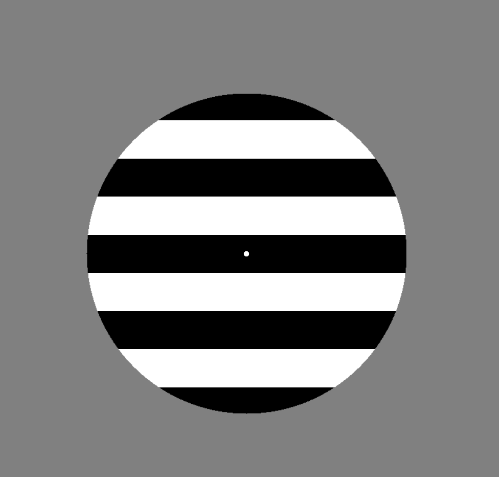

# A Pattern Glare Test PsychoPy project

This is a PsychoPy implementation of a Pattern Glare Test, including questions (in English) specifically targeted at participants with [synesthesia](https://en.wikipedia.org/wiki/Synesthesia). Participants are shown "gratings" and are then asked to describe their experiences (e.g. perceiving the grating as blurred or seeing non-black/white colors) while looking at the gratings. The gratings differ in how many black/white lines they are divided into. Three gratings of various spatial frequences (0.4, 3, 12.4) are presented one time each, with corresponding follow-up questions.

## Running the experiment
1. Install [Standalone PsychoPy](https://www.psychopy.org/download.html).
2. Download this project, by either using the green 'code' button and selecting 'Download ZIP', or by using `git clone` if you know Git.
3. Open up 'grating_pattern_glare.psyexp' with PsychoPy.
4. Click the cogwheel ('Edit experiment settings') icon, go to the 'Screen' tab, and insert specifications appropriate for your monitor (if you haven't already, you also need to set up a monitor in Monitor Center).
5. Click the Play ('Run experiment') icon.

## Experiment data output
The most relevant output data files are the 'CSV'/'.csv' files, saved to the 'data' directory. The most important columns in these files are as follows:

* grating_spatial_frequency: The spatial frequency of the grating shown in the trial.
* experience_confirm_click_time: How many seconds it took from 'experience' question presentation until the participant responded.
* reported_experiences: The response alternatives that the participant selected/answered with when asked an 'experience' question.
    - Example value: `['flicker', 'fading', 'shadowy']`. Note that each selected alternative is surrounded by apostrophes `'`, that alternatives are separated by commas `, `, and enclosed in square brackets `[]`.
* reported_experiences_other: If the participant chose to include a free text response (i.e. detailing an 'other' type of experience) when asked an 'experience' question, this is included here (otherwise blank).
* color_confirm_click_time: Similar to 'experience_confirm_click_time' column, but for question asking about experienced colors.
* experienced_colors: Similar to 'reported_experiences' column, but for experienced colors.
    - Example value: `['blue', 'purple', 'brown']`.
* discomfort_confirm_click_time: Similar to 'experience_confirm_click_time' column, but for question asking about discomfort.
* slider_discomfort.response: Indicates participant's rating of discomfort (ranging from -5, 'extremely discomfortable', to 5, 'extremely comfortable').
* slider_discomfort.rt: How many seconds it took from 'discomfort' question presentation until the participant responded. 

## Translating the experiment
In PsychoPy, go to the 'experiment_setup' routine and click the code component 'code_translation'. In the window that pops up, you can edit all messages/options shown to the participant throughout the experiment. You can see examples of translations in the 'translations' folder - it's recommended that you make a copy and edit one of them, then copy-paste the end results to the 'code_translation' code field once you're satisfied. Note how parentheses `()` and quotation marks `"` are used, as this formatting is necessary for the code to work with Python.

## (not) Running the experiment online
This PsychoPy implementation of the Pattern Glare Test was only developed for being used locally, i.e. not online. It's possible that you might convert this implementation to run online without too much trouble (by working with PsychoPy to convert to a JavaScript version), but this requires some programming knowledge. If you make an online version, you're very welcome to send an e-mail to datalowe-at-posteo.de so that I can add a link to your work here.

## Attribution
This Pattern Glare Test project is mainly based on the description found in [this article by Ward, J., Hoadley, C., Hughes, J. E., Smith, P., Allison, C., Baron-Cohen, S., and Simner, J. from 2017](https://www.nature.com/articles/srep41155) - please cite it in e.g. papers based on this project. It's not required, but it's appreciated if you also share a link to this project's code repository [https://github.com/AnonZebra/pattern-glare-psychopy](https://github.com/AnonZebra/pattern-glare-psychopy) in order to help spread the word.

This PsychoPy implementation was created by Lowe Wilsson while working in a research group, led by Janina Neufeld, at Karolinska Institutet.
